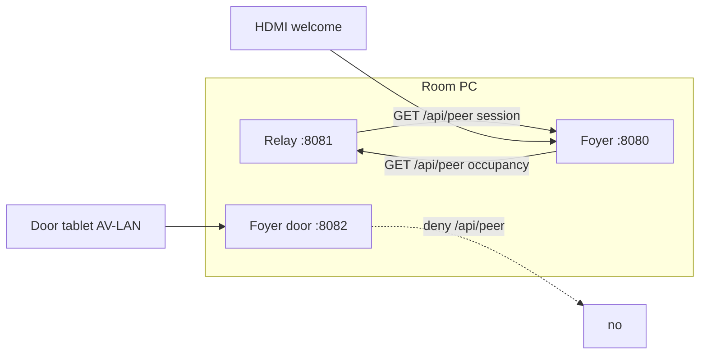

# Foyer ↔ Relay communication contract

This file is **identical** in:

- [Relay-AV-Room-Control-](https://github.com/richardosseweijer/Relay-AV-Room-Control-)/`FOYER-RELAY.md`
- [Foyer-Room-Signage](https://github.com/richardosseweijer/Foyer-Room-Signage)/`FOYER-RELAY.md`

Change both trees in the same train. If this file and the code disagree, **the code wins** — then fix this file.

| | |
|---|---|
| Contract | 1 |
| Date | 2026-09-14 |
| Relay | **0.9.7** (`v0.9.7`) |
| Foyer | **0.2.2** (`v0.2.2`) |

Relay [`FOYER-ROADMAP.md`](https://github.com/richardosseweijer/Relay-AV-Room-Control-/blob/main/FOYER-ROADMAP.md) is implementation history. This file is the live wire.

---

## 1. Parties

One Ubuntu room PC, one room, two Node processes. They do not import each other. They do not share disk, PIN, ICS URL, or secret file.

| Process | Owns | Production listen |
|---|---|---|
| **Relay** | Devices, panel, occupancy | `0.0.0.0:8081` (`npm start`) |
| **Foyer** | Pictures, calendar, plates | Welcome/Setup `0.0.0.0:8080`; door plate AV-LAN `:8082` |

Relay Grok/dev stays `:8080`. That is not the room-PC contract. On the room PC, Foyer keeps `:8080` / `:8082` and Relay production is `:8081`. Do not move Foyer.

Room names in the two apps **do not have to match**. There is no name join, no occupancy-variable picker, and no “match room” field.

---

## 2. Isolation

| Shared | Not shared |
|---|---|
| This PC (loopback `127.0.0.1`) | `data/relay-*.json` and `data/foyer-*.json` |
| HTTP `GET /api/peer` on loopback | PINs, ICS URLs, display tokens, device tokens |
| Occupancy enum (below) | NIC pickers (each app lists `os.networkInterfaces()` itself) |
| Optional peer secret (HMAC POST / signed GET) | Package imports, JSON drivers, secret files |

HMAC, when used, is **loopback only**. Do not put the peer secret on AV-LAN, guest Wi-Fi, or a NIC address. Do not port-forward `8080`, `8081`, or `8082`.

---

## 3. Topology



Two **pulls**. Neither side pushes occupancy or calendar.

| Pull | Client | Server | Path | Period | Timeout |
|---|---|---|---|---|---|
| Occupancy | Foyer | Relay `:8081` | `GET /api/peer` | 4 s | 4 s |
| Calendar session | Relay | Foyer `:8080` | `GET /api/peer` | 4 s (debounce 3.5 s) | 4 s |

Foyer also refreshes occupancy after each calendar ingest (calendar ingest itself is 30 s).

Default URLs (loopback only):

| Client setting | Default |
|---|---|
| Foyer Setup → Relay URL | `http://127.0.0.1:8081` |
| Relay Room tab → Foyer URL | `http://127.0.0.1:8080` |

A non-loopback URL is **fail closed** (client does not send). Loopback hostnames: `127.0.0.1`, `localhost`, `::1`.

Foyer door `:8082` **denies** `/api/peer`. Calendar GET is welcome `:8080` only.

---

## 4. Occupancy (Foyer reads Relay)

Relay is the occupancy **writer**. Foyer never POSTs occupancy. Relay never POSTs occupancy to Foyer.

### 4.1 Relay values

Canonical field `room.occupancy`, also baked list var `occupancy`:

| Value | Meaning |
|---|---|
| `available` | Free (default) |
| `in-session` | In use |
| `busy` | Occupied / private |
| `do-not-disturb` | DND |
| `closed` | Closed |

Set from:

- Configurator → Room → Occupancy, then **Save all**
- Host commands `occupancy.available` / `occupancy.in-session` / `occupancy.busy` / `occupancy.do-not-disturb` / `occupancy.closed`
- Macro / `var.set` on baked `occupancy`

Feedback id `occupancy.state`. Persist on successful command.

Aliases Relay accepts when writing the field: `free`/`idle`/`0`/`false` → `available`; `insession`/`occupied`/`1`/`true`/`on` → `in-session`; `off` → `closed`; `dnd` → `do-not-disturb`.

### 4.2 Request (Foyer → Relay)

```
GET /api/peer HTTP/1.1
Host: 127.0.0.1:8081
```

No body. Clients **do not send HMAC** on this GET (a mismatched pasted secret must not 401 the plate). HMAC, if a client ever sends `x-relay-auth` / `x-relay-ts`, must verify.

Foyer only sends when **Read occupancy from Relay on this PC** is on and the URL is loopback. First boot and loopback migrate turn that switch on.

### 4.3 Response (Relay)

Unsigned loopback GET (TCP peer `127.0.0.1` / `::1` / `::ffff:127.0.0.1`, no HMAC headers):

```json
{
  "ok": true,
  "v": 1,
  "occupancy": "available",
  "host": { "locked": false }
}
```

HMAC GET (Relay-to-Relay, or loopback with headers) still returns the fat object:

```json
{
  "ok": true,
  "v": 1,
  "room": { "id": "<relay-room-id>", "name": "<relay-room-name>" },
  "host": { "dim": false, "locked": false, "pageId": null },
  "occupancy": "available",
  "vars": { "occupancy": { "name": "Occupancy", "value": "available" } },
  "macros": {}
}
```

`room` is an **object**, never a string. `vars` / `macros` are for Relay-to-Relay peers; Foyer occupancy does not read them. Foyer occupancy uses `occupancy` and `host.locked` only — both bodies work.


### 4.4 What Foyer uses

Only:

1. `ok === true`
2. `occupancy` — one of `available` | `in-session` | `busy` | `do-not-disturb` | `closed` (plus the same aliases as above, and `do not disturb`)
3. `host.locked === true` **only if** `occupancy` is missing → treated as `in-session`

Ignored for occupancy: `room`, `room.id`, `room.name`, `vars`, `macros`. Unknown occupancy string → no Relay value (calendar/hours apply).

That value is applied to **this Foyer’s room** (the one room on this PC). No name match.

### 4.5 Plate status (Foyer compose)

Foyer Setup occupancy:

| Setup | Plate |
|---|---|
| **Auto** | If Relay occupancy is present, that **is** the status (beats hours and a live meeting). Else hours → calendar (`busy` / `in-session` / `starting-soon` / `available`). After hours with no Relay value → `closed`. |
| Available / In session / Do not disturb / Closed | Local override. Beats Relay and calendar. Not written back to Relay. |

`starting-soon` is Foyer-only (ten-minute window). Relay has no such occupancy.

The agenda (`now` / `next` / following) still paints when occupancy is forced. Occupancy is the **status chip**, not the calendar.

HTTP 4xx/5xx, timeout, bad JSON, `ok: false`, or a non-loopback URL: keep **last-good** occupancy snapshot. Do not invent `available`.

---

## 5. Calendar session (Relay reads Foyer)

Foyer is the calendar **writer**. Relay never reads ICS, Foyer data files, or Google.

### 5.1 Session choice

On Foyer `GET /api/peer`, from this PC’s calendar snapshot (first room, or the only room):

1. If a meeting is live (`start ≤ now < end`) → `{ kind: "now", title, startIso, endIso }`
2. Else if a next meeting exists with `start > now` → `{ kind: "next", title, startIso, endIso }`
3. Else → `session: null`

Title is the already-sanitized plate title (no `{RoomName}` token, no HTML). Times are ISO-8601. Private/busy events still have a title of `Busy` on the plate; that string is what Relay gets.

### 5.2 Request (Relay → Foyer)

```
GET /api/peer HTTP/1.1
Host: 127.0.0.1:8080
```

No body. Unsigned loopback GET. Non-loopback Foyer URL: Relay does not send. Door `:8082` does not serve this route.

Empty Foyer URL on the Room tab: skip the poll (default is `http://127.0.0.1:8080`, so a filled default always polls).

### 5.3 Response (Foyer)

Live meeting:

```json
{
  "ok": true,
  "v": 1,
  "session": {
    "kind": "now",
    "title": "Design review",
    "startIso": "2026-09-11T10:00:00.000Z",
    "endIso": "2026-09-11T11:00:00.000Z"
  }
}
```

Next meeting (room free):

```json
{
  "ok": true,
  "v": 1,
  "session": {
    "kind": "next",
    "title": "Board lunch",
    "startIso": "2026-09-11T12:00:00.000Z",
    "endIso": "2026-09-11T13:00:00.000Z"
  }
}
```

Empty:

```json
{ "ok": true, "v": 1, "session": null }
```

Unauthorized (not loopback, or HMAC sent and wrong):

```json
{ "ok": false, "message": "Auth failed" }
```

HTTP 401.

Relay parse requires `kind` `now`|`next`, and non-empty `startIso` + `endIso`. Missing times → treat as no session. `title` may be `""`.

### 5.4 Baked Relay vars

| Id | Kind | Values / default |
|---|---|---|
| `foyer.kind` | enum | `now` / `next` / `none` (default `none`) |
| `foyer.title` | text | `""` |
| `foyer.start` | text | ISO start or `""` |
| `foyer.end` | text | ISO end or `""` |

Not editable on the Logic tab. Room tab Occupancy / Foyer card shows the live line.

`session: null` and a successful `ok: true` write `none` + empty strings. **Failed** fetch leaves the previous vars (do not flash `none` on a blip).

---

## 6. Auth

### 6.1 Loopback GET (this contract)

| Server | Unsigned loopback GET | HMAC if headers sent | Non-loopback GET |
|---|---|---|---|
| Relay `:8081/api/peer` | Allow | Must verify against Relay peer secret | Allowed **only** with valid HMAC (Relay-to-Relay). Foyer client never uses this. |
| Foyer `:8080/api/peer` | Allow | Must verify against Foyer `relaySecret` | **Deny** (even with HMAC) |

Loopback test: **TCP `remoteAddress`** of the accepted socket (`127.0.0.1` / `::1` / `::ffff:127.0.0.1`). Missing or unreadable peer → not loopback. `Host`, `X-Forwarded-For`, and `X-Forwarded-Host` are **not** loopback. The process still listens on `0.0.0.0`; unsigned GET is denied unless the TCP peer is loopback.


### 6.2 HMAC formula (when headers are sent)

Headers:

- `x-relay-ts` — `String(Date.now())` (milliseconds)
- `x-relay-auth` — HMAC-SHA256, **64 lowercase hex**

Payload bytes (UTF-8):

```
${ts}\n${method}\n${path}\n${body}
```

For these GETs: method `GET`, path exactly `/api/peer`, body `""`.

Rules: empty key → deny signed requests; uppercase hex → deny; skew ±90 s → deny; replay of the same digest+ts within 90 s → deny; compare with `timingSafeEqual`.

Foyer and Relay occupancy/session **clients currently omit HMAC** on loopback GET. Paste the same peer secret in both UIs only if you want signed GET or Relay-to-Relay POST macros. Occupancy and calendar work with a blank Foyer secret.

### 6.3 POST `/api/peer` (not this contract)

Relay POST `/api/peer` runs **allow-listed macros** only, HMAC required, host commands rejected. Foyer does not POST. That is Relay-to-Relay, documented in Relay Security, not occupancy/calendar.

---

## 7. Operator setup (room PC)

After **Update from GitHub** on both apps:

1. **Foyer Setup**
   - Occupancy = **Auto**
   - **Read occupancy from Relay on this PC** on
   - Relay URL `http://127.0.0.1:8081`
   - Peer secret may stay blank
2. **Relay Configurator → Room → Occupancy / Foyer**
   - Occupancy list; **Save all** (or fire Occupancy commands on the panel)
   - Foyer URL `http://127.0.0.1:8080`
   - Within a few seconds the card shows `now`/`next` plus title and times, or “No session from Foyer yet.”

Plate ignores Relay → Foyer occupancy is not Auto, or the occupancy poll is off, or Relay is down (last-good / empty).

Relay stays on “No session” → Foyer has no live or upcoming event, Foyer is down, Foyer URL is not loopback, or the LAN (internet) NIC has no IPv4 so calendar was not pulled.

---

## 8. Failure

| Event | Occupancy (Foyer) | Session (Relay) |
|---|---|---|
| Timeout / network error | Keep last-good | Keep previous vars |
| HTTP not 2xx / `ok: false` | Keep last-good | Keep previous vars |
| Bad JSON | Keep last-good | Keep previous vars |
| Non-loopback URL | Do not send; last-good | Do not send; previous vars |
| Poll switch off / empty URL | Last-good / skip | Skip (`foyer.*` unchanged) |
| `session: null` with `ok: true` | — | Write `none` + empty |
| Missing `occupancy` and not locked | No Relay value; hours/calendar | — |

Do not fallback onto AV-LAN. Do not fallback onto a second URL.

---

## 9. Out of contract

Do not add these without a new contract revision in **both** trees:

- Relay POST occupancy to Foyer
- Foyer as a Relay device (poll/POST driver)
- Shared `data/`, PIN, ICS, or secret file
- Importing the other package
- Occupancy via `vars` / room-name match
- HMAC on a NIC / tablet / internet address
- Serving Foyer `/api/peer` on `:8082`
- Moving Foyer off `:8080` / `:8082` on the room PC
- Dual Node listen sockets on one process
- Central monitor

Relay-to-Relay HMAC macros stay allowed on Relay `:8081`; they are a different API that happens to share the path.

---

## 10. Source (do not cross-import)

**Relay 0.9.4**

| Piece | File |
|---|---|
| Occupancy field + `GET` body | `src/lib/control/peer-payload.ts` |
| HMAC / loopback GET | `src/lib/control/peer-auth.ts` |
| Peer route | `src/routes/api/peer.ts` |
| Occupancy commands | `src/lib/control/engine.ts` (`occupancy.*`), `src/lib/control/defaults.ts` |
| Foyer session poll | `src/lib/control/foyer-peer.ts`, `src/lib/control/store.server.ts` |
| UI | `src/components/config/room-tab.tsx`, `logic-tab.tsx`, `security-tab.tsx` |
| Tests | `scripts/peer-occupancy.test.mjs`, `scripts/foyer-peer.test.mjs` |

**Foyer 0.2.2**

| Piece | File |
|---|---|
| Occupancy GET client + HMAC + session body | `src/lib/foyer/relay.ts` |
| Session pick | `src/lib/foyer/calendar.ts` (`sessionFromCalendar`) |
| Peer route | `src/routes/api/peer.ts` (`:8080` only) |
| Door deny | `src/lib/foyer/listen.ts` (`panelDecision("/api/peer")` = deny) |
| Occupancy poll 4 s | `src/lib/foyer/store.server.ts` |
| Plate status | `src/lib/foyer/compose.ts` (`statusForRoom`) |
| First boot / migrate poll on | `src/lib/foyer/seed.ts` |
| UI | `src/components/foyer/config/ConfigApp.tsx` |
| Tests | `src/lib/foyer/relay.test.ts`, `calendar.test.ts`, `listen.test.ts`, `compose.test.ts`, `seed.test.ts` |
