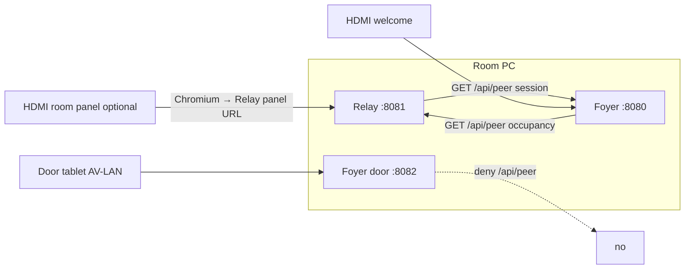

# Foyer ↔ Relay communication contract

This file is **identical** in:

- [Relay-AV-Room-Control-](https://github.com/richardosseweijer/Relay-AV-Room-Control-)/`FOYER-RELAY.md`
- [Foyer-Room-Signage](https://github.com/richardosseweijer/Foyer-Room-Signage)/`FOYER-RELAY.md`

Change both trees in the same train. If this file and the code disagree, **the code wins** — then fix this file.

| | |
|---|---|
| Contract | 1 |
| Date | 2026-09-23 |
| Relay | **0.9.47+** (prefer `v0.9.49`; AV listen + `controlBaseUrlFrom` from Relay #127) |
| Foyer | **0.2.3** (`v0.2.3`) — host unit installer (K7b); occupancy URL rewrite-on-load + `http:` allowlist |

Relay [`FOYER-ROADMAP.md`](https://github.com/richardosseweijer/Relay-AV-Room-Control-/blob/main/FOYER-ROADMAP.md) is implementation history. This file is the live wire.

---

## Day-one dual-head (same host)

**Start here** on a **Dell Wyse 5070 / Ubuntu Server** room PC with dual DisplayPort (or HDMI) when Foyer and Relay share one box. One checklist; details stay in Foyer [`INSTALL.md`](https://github.com/richardosseweijer/Foyer-Room-Signage/blob/main/INSTALL.md) §7 / §7c and Relay [`LINUX.md`](https://github.com/richardosseweijer/Relay-AV-Room-Control-/blob/main/LINUX.md) §5b / §7a. Do **not** invent new units — use the existing `foyer` / `foyer-panel` / `foyer-kiosk` and `relay` services only.

**Production shape (lock this):**

| Piece | Owner |
|---|---|
| Displays | **Foyer** — `foyer` + `foyer-panel` + `foyer-kiosk` (sway, up to two Chromiums: Welcome + Room panel) |
| Panel HTTP | **Relay** — AV-LAN IPv4 `:8081` only (never `0.0.0.0`) |
| Relay local compositor | **Off** — `systemctl disable --now relay-kiosk` when Foyer paints the Room panel head |
| Host units + sudoers (one-time each) | Foyer `scripts/install-host.sh` (foyer + foyer-panel + foyer-kiosk ON); Relay `scripts/install-host.sh` (relay ON; relay-kiosk left off) |
| Room-panel URL | Live AV-LAN `http://<av-lan-ipv4>:8081` — never `0.0.0.0`; not loopback for peer occupancy on dual-NIC |

### Checklist

- [ ] **Packages** — Foyer seatd / sway / Chromium per INSTALL §7 (enable **universe** on minimal Server; noble `apt` Chromium is the snap — `FOYER_CHROMIUM_NO_SANDBOX=1` when the journal shows sandbox errors); Relay clone + build + AV-LAN listen per LINUX §4 / §5 (then host units §6a). Do not enable `relay-kiosk` on this host.
- [ ] **Foyer host install (once)** — after Packages above: from the Foyer checkout `sudo bash scripts/install-host.sh` → units `foyer` + `foyer-panel` + `foyer-kiosk` enabled, plus `/etc/sudoers.d/foyer-kiosk` (Update / pull / reboot do **not** install these). If you installed host units before §7 packages, use `install-host.sh --skip-kiosk-enable` then `systemctl enable --now foyer-kiosk` after packages (INSTALL §6a / §7a).
- [ ] **Relay host install (once)** — from the Relay checkout: `sudo bash scripts/install-host.sh` → `relay` enabled; `relay-kiosk` installed but left **disabled**; sudoers `relay-kiosk` + `relay-nmcli` (same: not installed by Update / pull / reboot).
- [ ] **Disable Relay kiosk** — Configurator → Room → Local display: leave **Enable** unchecked (or uncheck + Save) so Relay runs `systemctl disable --now relay-kiosk`; CLI fallback: `sudo systemctl disable --now relay-kiosk`. Foyer alone owns tty1 / DRM (LINUX §7a).
- [ ] **AV-LAN bind + Room-panel URL** — Relay listens on live AV-LAN IPv4 `:8081`; Foyer Setup Relay URL / Room panel URL = `http://<av-lan-ipv4>:8081` (never `0.0.0.0`; not `127.0.0.1` for peer occupancy on dual-NIC).
- [ ] **Foyer kiosk heads** — Setup picks **Welcome HDMI** and/or **Room panel HDMI** (different connectors if both); confirm `systemctl is-enabled foyer-kiosk` (INSTALL §7a / §7c). Re-run Foyer `install-host.sh` if the unit was skipped earlier.
- [ ] **Verify** — Welcome head shows Foyer `http://127.0.0.1:8080/`; Room panel head shows Relay control UI from the AV-LAN URL; `systemctl status foyer-kiosk` active; `relay-kiosk` disabled / inactive.
- [ ] **Firewall** — if not already done: Foyer INSTALL §5 and Relay LINUX §5b (8080/8082 and 8081 from AV CIDR only; never bare `allow …/tcp` from anywhere; no WAN port-forward).

Operator Setup / occupancy paste steps after displays are up: §7 below.

## 1. Parties

One Ubuntu room PC, one room, two Node processes. They do not import each other. They do not share disk, PIN, ICS URL, or secret file.

| Process | Owns | Production listen |
|---|---|---|
| **Relay** | Devices, panel, occupancy | **AV-LAN IPv4** `:8081` (`npm start`) — never `0.0.0.0`. |
| **Foyer** | Pictures, calendar, plates | Welcome/Setup `0.0.0.0:8080`; door plate AV-LAN `:8082` |

Relay Grok/dev stays `:8080`. That is not the room-PC contract. On the room PC, Foyer keeps `:8080` / `:8082` and Relay production is `:8081`. Do not move Foyer.

Room names in the two apps **do not have to match**. There is no name join, no occupancy-variable picker, and no “match room” field.

---

## 2. Isolation

| Shared | Not shared |
|---|---|
| This PC (same box; AV-LAN IPv4 and/or loopback) | `data/relay-*.json` and `data/foyer-*.json` |
| HTTP `GET /api/peer` (occupancy on Relay AV `:8081`; session on Foyer loopback `:8080`) | PINs, ICS URLs, display tokens, device tokens |
| Occupancy enum (below) | NIC pickers (each app lists `os.networkInterfaces()` itself) |
| Optional peer secret (HMAC POST / signed GET) | Package imports, JSON drivers, secret files |

Do not put the peer secret on guest Wi-Fi or a foreign NIC. Do not port-forward `8080`, `8081`, or `8082`. Occupancy client URL is **`http:` only** to loopback or this PC’s AV-LAN IPv4.

---

## 3. Topology



**Displays (same host):** Foyer owns local HDMI/DP when Setup picks Welcome and/or Room panel (`foyer-kiosk` / sway). Relay serves the panel over AV-LAN HTTP; do **not** also run Relay `relay-kiosk` on that PC (two compositors fight tty1 / DRM). Disable steps: Relay [`LINUX.md`](LINUX.md) §7a. Foyer lab checklist: Foyer `INSTALL.md` §7b / §7c.

Two **pulls**. Neither side pushes occupancy or calendar.

| Pull | Client | Server | Path | Period | Timeout |
|---|---|---|---|---|---|
| Occupancy | Foyer | Relay `:8081` | `GET /api/peer` | 4 s | 4 s |
| Calendar session | Relay | Foyer `:8080` | `GET /api/peer` | 4 s (debounce 3.5 s) | 4 s |

Foyer also refreshes occupancy after each calendar ingest (calendar ingest itself is 30 s).

Default URLs:

| Client setting | Default |
|---|---|
| Foyer Setup → Relay URL | `http://<av-lan-ipv4>:8081` (live AV NIC; Room → Occupancy shows the paste URL). Soft-fail if AV unset / no IPv4. Lab: `http://127.0.0.1:8081` only with `RELAY_LISTEN_HOST=127.0.0.1`. On every Foyer load, empty or loopback Relay URL is rewritten to the live AV URL when AV IPv4 is set; a deliberately set non-loopback URL is left alone. |
| Relay Room tab → Foyer URL | `http://127.0.0.1:8080` |

Allowed Foyer→Relay URL: scheme **`http:` only** (reject `https://`); host **loopback** (`127.0.0.1` / `localhost` / `::1`) **or** this PC’s live **AV-LAN IPv4** (same address Relay listens on). Other hosts / schemes are **fail closed** (client does not send).

Foyer door `:8082` **denies** `/api/peer`. Calendar GET is welcome `:8080` only.

---

## 4. Occupancy (Foyer reads Relay)

Relay is the occupancy **writer**. Foyer never POSTs occupancy. Relay never POSTs occupancy to Foyer.

### 4.1 Relay values

Canonical field `room.occupancy` (what Foyer GET reads). Relay’s baked var `occupancy` is `0`–`3`:

| Var | Foyer `occupancy` | Meaning |
|---|---|---|
| `0` | `closed` | Closed |
| `1` | `available` | Open (default) |
| `2` | `in-session` | In session (`busy` writes this too) |
| `3` | `do-not-disturb` | DND |

Set from:

- Occupancy variable (`0` / `1` / `2` / `3`) or macro **Set variable**
- Host commands `occupancy.closed` / `occupancy.open` / `occupancy.in-session` / `occupancy.do-not-disturb` (`occupancy.available` and `occupancy.busy` still map to open / in-session)

There is no Room-tab occupancy dropdown (it fought the live var on Save). Feedback id `occupancy.state` is `0`–`3`. Persist on successful command.

Aliases Relay accepts when writing: `open`/`free`/`idle`/`false` → open; `insession`/`occupied`/`true`/`on`/`busy` → in-session; `off` → closed; `dnd` → do-not-disturb. Foyer still reads the **string** `occupancy` field, not the var.

### 4.2 Request (Foyer → Relay)

```
GET /api/peer HTTP/1.1
Host: <av-lan-ipv4>:8081
```

No body. Clients **do not send HMAC** on this GET (a mismatched pasted secret must not 401 the plate). HMAC, if a client ever sends `x-relay-auth` / `x-relay-ts`, must verify.

Foyer only sends when **Read occupancy from Relay on this PC** is on and the URL is allowed (`http:` + loopback or this PC’s AV IPv4). First boot and Relay-defaults (including rewrite-on-load) turn that switch on when the URL is allowed.

### 4.3 Response (Relay)

Unsigned loopback GET (TCP peer `127.0.0.1` / `::1` / `::ffff:127.0.0.1`, no HMAC headers):

```json
{
  "ok": true,
  "v": 1,
  "occupancy": "available",
  "host": { "locked": false }
}
```

HMAC GET (Relay-to-Relay, or loopback with headers) still returns the fat object:

```json
{
  "ok": true,
  "v": 1,
  "room": { "id": "<relay-room-id>", "name": "<relay-room-name>" },
  "host": { "dim": false, "locked": false, "pageId": null },
  "occupancy": "available",
  "vars": { "occupancy": { "name": "Occupancy", "value": "1" } },
  "macros": {}
}
```

`room` is an **object**, never a string. `vars` / `macros` are for Relay-to-Relay peers; Foyer occupancy does not read them. Foyer occupancy uses `occupancy` and `host.locked` only — both bodies work.


### 4.4 What Foyer uses

Only:

1. `ok === true`
2. `occupancy` — one of `available` | `in-session` | `busy` | `do-not-disturb` | `closed` (plus the same aliases as above, and `do not disturb`)
3. `host.locked === true` **only if** `occupancy` is missing → treated as `in-session`

Ignored for occupancy: `room`, `room.id`, `room.name`, `vars`, `macros`. Unknown occupancy string → no Relay value (calendar/hours apply).

That value is applied to **this Foyer’s room** (the one room on this PC). No name match.

### 4.5 Plate status (Foyer compose)

Foyer Setup occupancy:

| Setup | Plate |
|---|---|
| **Auto** | If Relay occupancy is present, that **is** the status (beats hours and a live meeting). Else hours → calendar (`busy` / `in-session` / `starting-soon` / `available`). After hours with no Relay value → `closed`. |
| Available / In session / Do not disturb / Closed | Local override. Beats Relay and calendar. Not written back to Relay. |

`starting-soon` is Foyer-only (ten-minute window). Relay has no such occupancy.

The agenda (`now` / `next` / following) still paints when occupancy is forced. Occupancy is the **status chip**, not the calendar.

HTTP 4xx/5xx, timeout, bad JSON, `ok: false`, or a disallowed URL (not loopback and not this PC’s AV-LAN IPv4): keep **last-good** occupancy snapshot. Do not invent `available`.

---

## 5. Calendar session (Relay reads Foyer)

Foyer is the calendar **writer**. Relay never reads ICS, Foyer data files, or Google.

### 5.1 Session choice

On Foyer `GET /api/peer`, from this PC’s calendar snapshot (first room, or the only room):

1. If a meeting is live (`start ≤ now < end`) → `{ kind: "now", title, startIso, endIso }`
2. Else if a next meeting exists with `start > now` → `{ kind: "next", title, startIso, endIso }`
3. Else → `session: null`

Title is the already-sanitized plate title (no `{RoomName}` token, no HTML). Times are ISO-8601. Private/busy events still have a title of `Busy` on the plate; that string is what Relay gets.

### 5.2 Request (Relay → Foyer)

```
GET /api/peer HTTP/1.1
Host: 127.0.0.1:8080
```

No body. Unsigned loopback GET. Non-loopback Foyer URL: Relay does not send. Door `:8082` does not serve this route.

Empty Foyer URL on the Room tab: skip the poll (default is `http://127.0.0.1:8080`, so a filled default always polls).

### 5.3 Response (Foyer)

Live meeting:

```json
{
  "ok": true,
  "v": 1,
  "session": {
    "kind": "now",
    "title": "Design review",
    "startIso": "2026-09-11T10:00:00.000Z",
    "endIso": "2026-09-11T11:00:00.000Z"
  }
}
```

Next meeting (room free):

```json
{
  "ok": true,
  "v": 1,
  "session": {
    "kind": "next",
    "title": "Board lunch",
    "startIso": "2026-09-11T12:00:00.000Z",
    "endIso": "2026-09-11T13:00:00.000Z"
  }
}
```

Empty:

```json
{ "ok": true, "v": 1, "session": null }
```

Unauthorized (not loopback, or HMAC sent and wrong):

```json
{ "ok": false, "message": "Auth failed" }
```

HTTP 401.

Relay parse requires `kind` `now`|`next`, and non-empty `startIso` + `endIso`. Missing times → treat as no session. `title` may be `""`.

### 5.4 Baked Relay vars

| Id | Kind | Values / default |
|---|---|---|
| `foyer.kind` | enum | `now` / `next` / `none` (default `none`) |
| `foyer.title` | text | `""` |
| `foyer.start` | text | ISO start or `""` |
| `foyer.end` | text | ISO end or `""` |

Not editable on the Logic tab. Room tab Occupancy / Foyer card shows the live line.

`session: null` and a successful `ok: true` write `none` + empty strings. **Failed** fetch leaves the previous vars (do not flash `none` on a blip).

---

## 6. Auth

### 6.1 Loopback GET (this contract)

| Server | Unsigned loopback GET | HMAC if headers sent | Non-loopback GET |
|---|---|---|---|
| Relay `:8081/api/peer` | Allow | Must verify against Relay peer secret | Allowed **only** with valid HMAC (Relay-to-Relay). Foyer client never uses this. |
| Foyer `:8080/api/peer` | Allow | Must verify against Foyer `relaySecret` | **Deny** (even with HMAC) |

Local peer test: **TCP `remoteAddress`** of the accepted socket is loopback (`127.0.0.1` / `::1` / `::ffff:127.0.0.1`) **or equals the HTTP listen host** (same-PC hairpin to the AV-LAN IPv4). Missing or unreadable peer → not local. `Host`, `X-Forwarded-For`, and `X-Forwarded-Host` are **not** local. Relay listens on the **AV-LAN IPv4** only (A2) — never `0.0.0.0`. Foyer’s default Relay URL is that live AV IPv4 (`http://<av-lan-ipv4>:8081`); Room → Occupancy shows the paste value. Soft-fail when AV unset / no IPv4 (message, not a wrong loopback URL). Lab escape: `RELAY_LISTEN_HOST=127.0.0.1`. Unsigned GET is allowed only for a local peer (loopback or listen-host hairpin). Foyer may still listen on `0.0.0.0` for welcome/setup — that is Foyer’s binding, not Relay’s.


### 6.2 HMAC formula (when headers are sent)

Headers:

- `x-relay-ts` — `String(Date.now())` (milliseconds)
- `x-relay-auth` — HMAC-SHA256, **64 lowercase hex**

Payload bytes (UTF-8):

```
${ts}\n${method}\n${path}\n${body}
```

For these GETs: method `GET`, path exactly `/api/peer`, body `""`.

Rules: empty key → deny signed requests; uppercase hex → deny; skew ±90 s → deny; replay of the same digest+ts within 90 s → deny; compare with `timingSafeEqual`.

Foyer and Relay occupancy/session **clients currently omit HMAC** on loopback GET. Paste the same peer secret in both UIs only if you want signed GET or Relay-to-Relay POST macros. Occupancy and calendar work with a blank Foyer secret.

### 6.3 POST `/api/peer` (not this contract)

Relay POST `/api/peer` runs **allow-listed macros** only, HMAC required, host commands rejected. Foyer does not POST. That is Relay-to-Relay, documented in Relay Security, not occupancy/calendar.

---

## 7. Operator setup (room PC)

After **Update from GitHub** on both apps:

1. **Foyer Setup**
   - Occupancy = **Auto**
   - **Read occupancy from Relay on this PC** on
   - Relay URL `http://<av-lan-ipv4>:8081` (copy from Relay Room → Occupancy; not `127.0.0.1` on dual-NIC)
   - Peer secret may stay blank
   - Dual-head: **Welcome HDMI** + **Room panel HDMI** (different connectors). Room panel loads this Relay URL. Leave Relay `relay-kiosk` off ([`LINUX.md`](LINUX.md) §7a).
2. **Relay Configurator → Room → Occupancy / Foyer**
   - Set occupancy with the Occupancy var (`0`–`3`) or a Relay Occupancy command / macro
   - Foyer URL `http://127.0.0.1:8080`
   - Within a few seconds the card shows `now`/`next` plus title and times, or “No session from Foyer yet.”
   - **Local display (HDMI):** keep **Enable** unchecked when Foyer paints the Room panel head (Save runs `systemctl disable --now relay-kiosk`; CLI: `sudo systemctl disable --now relay-kiosk` if needed).

Plate ignores Relay → Foyer occupancy is not Auto, or the occupancy poll is off, or Relay is down (last-good / empty).

Relay stays on “No session” → Foyer has no live or upcoming event, Foyer is down, Foyer URL is not loopback, or the LAN (internet) NIC has no IPv4 so calendar was not pulled.

---

## 8. Failure

| Event | Occupancy (Foyer) | Session (Relay) |
|---|---|---|
| Timeout / network error | Keep last-good | Keep previous vars |
| HTTP not 2xx / `ok: false` | Keep last-good | Keep previous vars |
| Bad JSON | Keep last-good | Keep previous vars |
| Disallowed URL (not loopback / not AV listen IP) | Do not send; last-good | Do not send; previous vars |
| Poll switch off / empty URL | Last-good / skip | Skip (`foyer.*` unchanged) |
| `session: null` with `ok: true` | — | Write `none` + empty |
| Missing `occupancy` and not locked | No Relay value; hours/calendar | — |

Do not fallback onto AV-LAN. Do not fallback onto a second URL.

---

## 9. Out of contract

Do not add these without a new contract revision in **both** trees:

- Relay POST occupancy to Foyer
- Foyer as a Relay device (poll/POST driver)
- Shared `data/`, PIN, ICS, or secret file
- Importing the other package
- Occupancy via `vars` / room-name match
- HMAC on a NIC / tablet / internet address
- Serving Foyer `/api/peer` on `:8082`
- Moving Foyer off `:8080` / `:8082` on the room PC
- Dual Node listen sockets on one process
- Central monitor

Relay-to-Relay HMAC macros stay allowed on Relay `:8081`; they are a different API that happens to share the path.

---

## 10. Source (do not cross-import)

**Relay 0.9.47+**

| Piece | File |
|---|---|
| Occupancy field + `GET` body | `src/lib/control/peer-payload.ts` |
| HMAC / loopback GET | `src/lib/control/peer-auth.ts` |
| Peer route | `src/routes/api/peer.ts` |
| Occupancy commands | `src/lib/control/engine.ts` (`occupancy.*`), `src/lib/control/defaults.ts` |
| Foyer session poll | `src/lib/control/foyer-peer.ts`, `src/lib/control/store.server.ts` |
| UI | `src/components/config/room-tab.tsx`, `logic-tab.tsx`, `security-tab.tsx` |
| Tests | `scripts/peer-occupancy.test.mjs`, `scripts/foyer-peer.test.mjs` |

**Foyer 0.2.3**

| Piece | File |
|---|---|
| Occupancy GET client + HMAC + session body | `src/lib/foyer/relay.ts` |
| Session pick | `src/lib/foyer/calendar.ts` (`sessionFromCalendar`) |
| Peer route | `src/routes/api/peer.ts` (`:8080` only) |
| Door deny | `src/lib/foyer/listen.ts` (`panelDecision("/api/peer")` = deny) |
| Occupancy poll 4 s | `src/lib/foyer/store.server.ts` |
| Plate status | `src/lib/foyer/compose.ts` (`statusForRoom`) |
| First boot / migrate poll on | `src/lib/foyer/seed.ts` |
| UI | `src/components/foyer/config/ConfigApp.tsx` |
| Tests | `src/lib/foyer/relay.test.ts`, `calendar.test.ts`, `listen.test.ts`, `compose.test.ts`, `seed.test.ts` |
